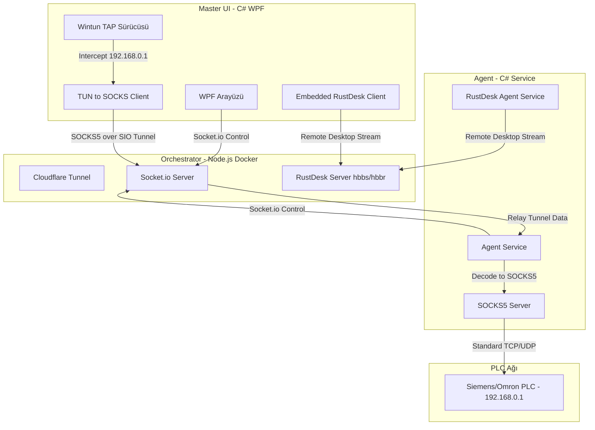

# Baris Technical Service Suite - Proje Kuralları ve Vizyonu

Bu dosya, projenin vizyonunu, mimarisini, teknik detaylarını ve kodlama standartlarını tanımlar. Yeni geliştiriciler (veya yapay zeka ajanları) bu dosyayı okuyarak projenin amacını ve yapısını anında kavramalıdır.

---

## 1. Proje Vizyonu ve Amacı

**Baris Technical Service Suite**, dünya genelindeki şantiyelerde kurulu olan beton blok ve parke taşı makinelerine uzaktan teknik servis verilmesini sağlayan endüstriyel bir uzak bağlantı ve teşhis yazılımıdır.

### Çözülen Sorunlar (Acı Noktaları):
1. **IP Çakışması (Subnet Collision):** Sahadaki PLC cihazları varsayılan olarak `192.168.0.1` IP'sindedir. Tailscale/VPN gibi çözümler tüm şantiyeleri tek bir alt ağda birleştirdiği için bu IP'ler çakışır ve bağlantı çöker. Bu yazılım, **oturum bazlı (session-based)** çalışarak sadece aktif şantiyenin `192.168.0.1` IP'sine özel tünel açar.
2. **Hız ve Hantallık:** MeshCentral gibi çözümler yavaştır. Bu yazılım RustDesk Core hızıyla pürüzsüz uzak masaüstü sağlar.
3. **Ticari Lisans ve Karmaşıklık:** AnyDesk/TeamViewer reklam/lisans uyarılarıyla doludur ve PLC'ye doğrudan tünel kuramaz. Bu yazılım tek tıkla gömülü (embedded) ekran ve arka plan PLC tüneli sağlar.

---

## 2. Teknoloji Yığını (Tech Stack)

### A. Merkezi Sunucu (Orchestrator)
- **Teknoloji:** Node.js (TypeScript) + Socket.io.
- **Dağıtım:** Evdeki Unraid sunucusunda Docker konteyneri.
- **Erişim:** Dış dünyaya Cloudflare Zero Trust Tunnel (WebSocket) ile açılacak.
- **Görevi:** Sadece el sıkışma (handshake), sinyalleşme, şantiye durum takibi (online/offline) ve veri tüneli aktarımı. Ağır veri taşımaz.

### B. Şantiye Ajanı (Agent)
- **Teknoloji:** C# .NET 8 (Windows Service olarak çalışır).
- **Yardımcı Araçlar:** RustDesk Core (Arayüzsüz / Headless modda çalışır, sadece ekran paylaşımı için).
- **Görevi:** WebSocket üzerinden Orchestrator'a bağlanmak, komutları almak, yerel SOCKS5 tünelini sonlandırmak ve PLC (`192.168.0.1`) ağ geçidi olmak.

### C. Kontrol Paneli (Master UI)
- **Teknoloji:** C# .NET 8 WPF (Windows Presentation Foundation).
- **Görevi:** Teknik personelin tek ekrandan tüm şantiyeleri izlemesi, çift tıklamayla tünel/ekran açması ve büyük kırmızı "OTURUMU KAPAT" butonu ile güvenli imha yapması.

---

## 3. Mimari Modüller ve Çalışma Prensibi

### Modül 1: Sinyalleşme ve Haberleşme
- Şantiyelerdeki Ajanlar ve Master UI, Orchestrator'a WebSocket ile bağlı kalır.
- Orchestrator aktif ajanların listesini anlık olarak Master UI'a iletir.
- Master UI bağlantı isteği gönderdiğinde ilgili ajana tetikleme sinyali gider.

### Modül 2: Gömülü Uzak Masaüstü (Embedded Remote Desktop)
- Master UI içinde harici pencere açılmaz. RustDesk Client penceresi Win32 API'leri (`SetParent`) kullanılarak WPF TabControl içine gömülür (embed).
- Fare, klavye girdileri ham (raw input) şekilde milisaniyelik gecikmeyle iletilir.
- Çift taraflı dosya transferi için RustDesk dosya kanalı veya uygulama içi bir SFTP/dosya gezgini kullanılır.

### Modül 3: Layer 3 Sanal Ağ ve PLC Tüneli (IP Çakışma Çözümü)
- Master UI bilgisayarında geçici bir sanal ağ arabirimi (**Wintun**) oluşturulur.
- Yerel bilgisayara `192.168.0.99` IP'si atanır ve `192.168.0.1` (PLC IP'si) trafiği Wintun'a yönlendirilir.
- Wintun'dan gelen tüm TCP/UDP paketleri bir tünel istemcisi aracılığıyla yakalanır, WebSocket üzerinden binary olarak Ajan'a iletilir.
- Ajan tarafında çalışan SOCKS5 sunucusu bu istekleri alarak yerel ağdaki `192.168.0.1` PLC cihazına yönlendirir.
- **Bu sayede:** Teknik personel TIA Portal veya CX-Programmer programına doğrudan `192.168.0.1` yazıp online olabilir, port/NAT ayarı yapması gerekmez.

### Modül 4: Session İmhası ve Güvenlik (Session-Based)
- Bağlantı sonlandırıldığında (veya beklenmedik kopmalarda heartbeat ile algılandığında):
  - Uzak ekran bileşeni dispose edilir.
  - Şantiyedeki ve yereldeki RustDesk süreçleri kapatılır.
  - Windows yönlendirme (routing) tablosu temizlenir.
  - Wintun sanal ağ arabirimi imha edilir.
  - Bilgisayar saniyeler içinde orijinal ağ ayarlarına döner. Arkada hiçbir açık port veya tünel kalmaz.

---

## 4. Kodlama ve Geliştirme Standartları

1. **Parçalı Mimari (Modülerlik):** 
   - Tek bir dosyada binlerce satır kod bulunması KABUL EDİLEMEZ.
   - Her sınıfın, servisin ve arayüzün sorumluluğu tek olmalıdır (Single Responsibility Principle).
   - Ağ işlemleri, UI işlemleri, WebSocket yönetimi ve süreç (process) yönetimi ayrı projelerde/klasörlerde toplanmalıdır.
2. **Endüstriyel Standart:**
   - Hata yönetimi (try-catch, fail-safe) en üst düzeyde olmalıdır. Özellikle ağ kartı oluşturma ve silme işlemlerinde çıkabilecek her türlü hata ele alınmalı, sistem asla "kirli" durumda bırakılmamalıdır.
   - Tüm asenkron operasyonlar `async/await` ile yönetilmelidir.
3. **Loglama:**
   - Hem Ajan tarafında hem de Master UI tarafında detaylı loglama (örn. Serilog) yapılmalıdır.
4. **Kod Kirliliğine Hayır:**
   - Kullanılmayan kodlar, gereksiz kütüphaneler projede yer almamalıdır.
   - Konfigürasyonlar (IP'ler, sunucu adresleri, portlar) kod içerisine gömülmemeli, JSON konfigürasyon dosyalarından okunmalıdır.
